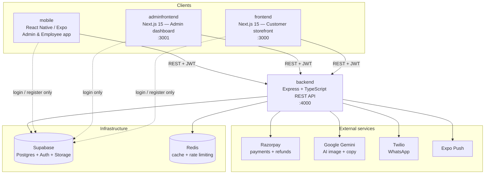

# NanaBanana — Project Documentation

Full-stack Indian e-commerce platform for sarees, dresses, and gold jewellery.

This folder documents the system architecture, data model, and runtime flows in depth.

## Contents

| Document | What it covers |
|---|---|
| [architecture.md](./architecture.md) | System architecture, the 4 apps, tech stack, request lifecycle, scalability design |
| [data-model.md](./data-model.md) | Database ER diagram, tables, enums, RPC functions, the `handle_new_user` trigger |
| [flows.md](./flows.md) | Sequence diagrams for every major flow — auth, checkout, refund, offline sale, product + AI, coupons, notifications |

## System at a glance

## The four applications

| App | Stack | Purpose | Users |
|---|---|---|---|
| **backend** | Express, TypeScript, Supabase JS v2 | Single REST API, business logic | — |
| **frontend** | Next.js 15 App Router, Tailwind v4, Zustand | Customer storefront | Customers |
| **adminfrontend** | Next.js 15 App Router, Tailwind v4, Recharts | Web admin dashboard | Admins |
| **mobile** | Expo SDK 54, React Native, NativeWind, React Query | Admin + employee app (product wizard, offline sales) | Admins, Employees |

Each app is independent — its own `package.json`, no monorepo tooling. npm only.

## Key principles

- **One API.** All product / cart / order / analytics data flows through the backend REST API. Supabase is contacted directly by clients *only* for `signUp` / `signInWithPassword`.
- **Two Supabase clients.** The backend holds a service-role client (bypasses RLS) and an anon client (auth calls only). They are never mixed.
- **Role-gated.** `admin`, `employee`, `customer`. Employees require admin approval before they can sign in.
- **Server-trusted money.** Order totals, discounts, and coupon validity are always recomputed server-side; never trusted from the client.
