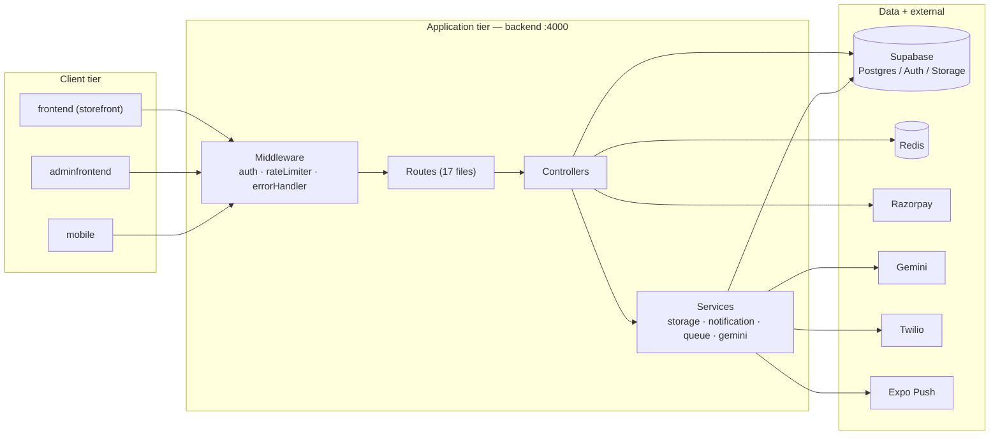
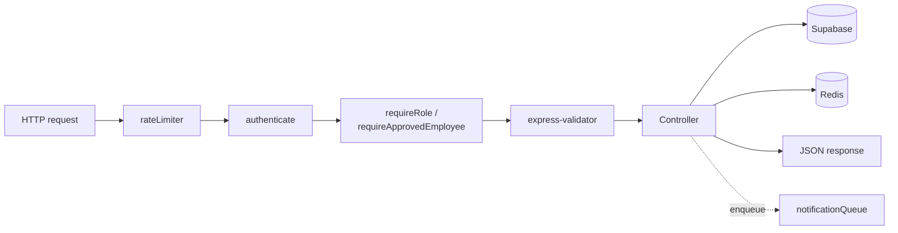
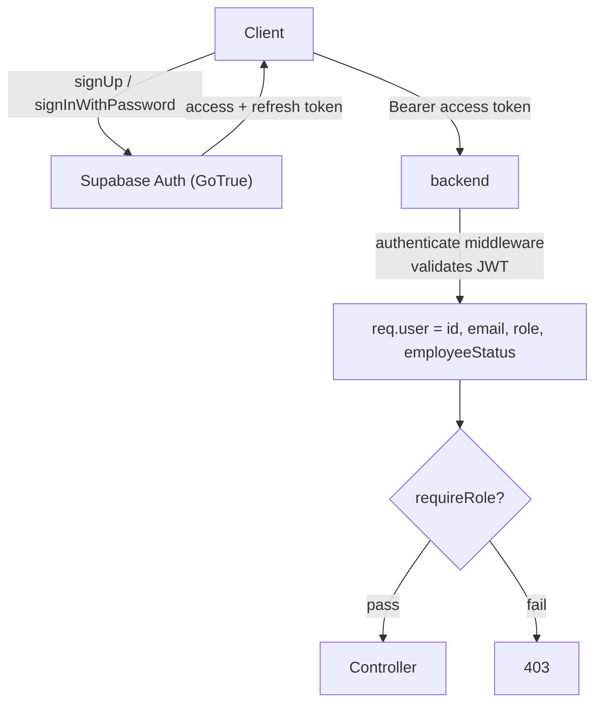
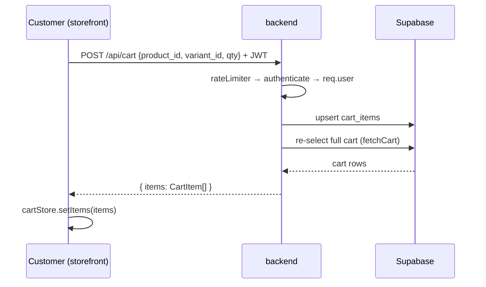

# Architecture

## 1. High-level system



## 2. Backend structure (`backend/src`)

```
index.ts          App bootstrap, middleware chain, route mounting, graceful shutdown
cluster.ts        Multi-core cluster (npm run start:cluster) — 1 worker per CPU
supabase.ts       Exports `supabase` (service-role) and `supabaseAuth` (anon)
types/index.ts    Shared types + VALID_ORDER_TRANSITIONS state machine

routes/           Thin HTTP wiring — 17 route files
  auth · products · variants · categories · orders · razorpay · cart
  wishlist · addresses · employees · users · coupons · analytics
  sales · ai · upload · notifications

controllers/      Business logic (orderController, productController,
                  analyticsController, salesController, employeeController, ...)

services/         Cross-cutting concerns
  storageService       Supabase Storage uploads
  notificationService  WhatsApp + push composition
  queueService         Async in-process notification queue
  geminiService        AI product image + copy generation

middleware/
  auth                 authenticate · requireRole · requireApprovedEmployee
  rateLimiter          Redis-backed limiters
  errorHandler         Central error formatter
```

### Route → Controller → Service pattern

Route files are thin: they map an HTTP verb to a controller function and attach
middleware. Business logic lives in controllers. Services hold cross-cutting
concerns (storage, notifications, AI).



## 3. The two Supabase clients

`backend/src/supabase.ts` exports two clients — **never interchangeable**:

| Client | Key | Used for |
|---|---|---|
| `supabase` | service-role | All data reads/writes. Bypasses Row Level Security. Admin auth ops (`auth.admin.*`). |
| `supabaseAuth` | anon | **Only** `signInWithPassword`. Calling sign-in/sign-up on the service-role client would swap its credentials for the user session and break every later RLS-protected read. |

Account creation uses `supabase.auth.admin.createUser({ email_confirm: true })` —
users are created pre-confirmed, so no verification email is sent (avoids
Supabase email rate limits) and no email-confirmation step exists.

## 4. Authentication & roles



- **Roles:** `admin`, `employee`, `customer`.
- `authenticate` validates the Supabase JWT and attaches `req.user`.
- `requireRole(...roles)` gates by role.
- `requireApprovedEmployee` admits admins and *approved* employees; rejects pending/rejected.
- **Employees** are created with `employee_status = 'pending'` and cannot enter the apps until an admin approves them.
- **Token refresh:** access tokens expire (~1h). Clients keep the refresh token; on a `401` they call `POST /auth/refresh`, get a new access token, and replay the request once.

## 5. Scalability design

| Concern | Mechanism |
|---|---|
| **Caching** | Redis (`ioredis`). Keys `nb:<entity>:<params>`. TTLs: products 5 min, product 10 min, categories 30 min, analytics 60 s, cart 30 s. A product mutation calls `delCachePattern('nb:products:*')`. |
| **Rate limiting** | Redis-backed. 100 req/min general · 10/min auth · 20/min upload · 30/min AI. |
| **Async notifications** | `queueService` — WhatsApp and Expo push are enqueued; the HTTP response returns before notifications fire. |
| **Cluster mode** | `cluster.ts` spawns one worker per CPU, auto-respawns on crash. |
| **Graceful shutdown** | SIGTERM/SIGINT close the HTTP server, quit Redis, with a 10 s force-kill. |
| **Health check** | `GET /health` — no auth, no rate limit; returns `{ status, redis, uptime }`. |
| **Atomic stock** | `decrement_variant_stock` RPC prevents overselling under concurrent orders. |

## 6. Frontend (customer storefront)

- **Next.js 15 App Router**, Tailwind v4 (`@theme` tokens, oklch colours), Zustand, React Hook Form + Zod.
- **Server vs Client components:** data-only pages are Server Components; pages using Zustand stores or event handlers are Client Components. The `AddToCartSection` pattern wraps client interactivity inside a server-rendered product page.
- **State:** three Zustand stores persisted to `localStorage` — `authStore` (JWT + refresh token + user), `cartStore` (cart items + applied coupon), `wishlistStore` (product IDs).
- **Hydration guard:** `hasHydrated` flag prevents redirecting to `/login` before the persisted store rehydrates.
- **Payments:** `RazorpayButton` lazy-loads `checkout.js`, calls `POST /api/razorpay/create`, opens the modal, then `POST /api/razorpay/verify`.

## 7. Mobile (admin / employee app)

- **Expo SDK 54**, React Native, NativeWind v4, Zustand + `expo-secure-store`, `@tanstack/react-query`, React Navigation.
- **Secure auth:** the auth store persists through `expo-secure-store` — the JWT never touches `AsyncStorage`.
- **Role-gated tabs:** `AdminTabs`, `EmployeeTabs`, `CustomerTabs` (view-mode toggle). A raised centre "+" FAB opens the product wizard.
- **Cross-platform dialogs:** `lib/dialog.js` wraps confirm/alert — `window.confirm` on Expo web (where `Alert.alert` button callbacks do not fire), native `Alert` on devices.
- **Fresh data:** `useRefetchOnFocus` re-runs React Query fetches whenever a screen regains focus.

## 8. Request lifecycle example — "Add to cart"



Every cart endpoint returns the full `{ items }` array so the client never has
to reconcile partial state.
