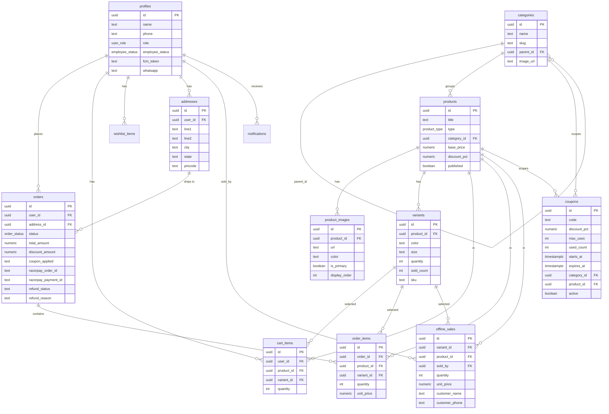
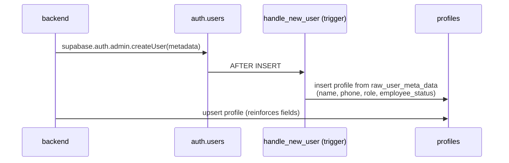
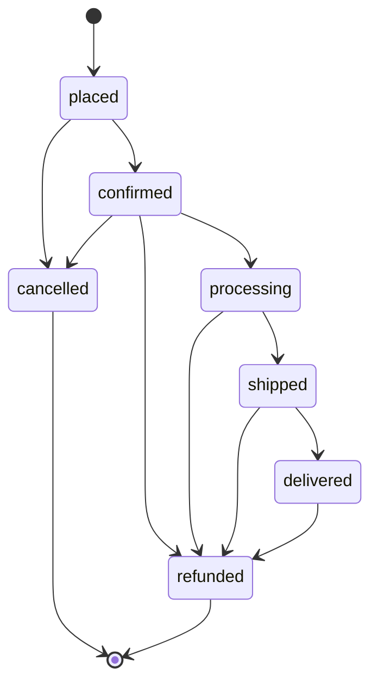

# Data Model

The database is **Supabase Postgres**. `backend/supabase_schema.sql` is the
single source of truth — tables, indexes, RLS, storage buckets, RPC functions,
and the seed of the three "type root" categories. There is no separate
migrations folder; the file is idempotent (`create ... if not exists`,
`alter table ... add column if not exists`).

## 1. Entity-relationship diagram



## 2. Tables

| Table | Purpose |
|---|---|
| `profiles` | Extends `auth.users`. Holds role, employee approval status, contact + push token. |
| `categories` | Self-referential tree. Three top-level "type roots" (`saree` / `dress` / `jewellery`); real categories nest under them via `parent_id`. |
| `products` | Catalogue item. `type` = saree / dress / jewellery. `published` gates storefront visibility. |
| `variants` | A buyable unit of a product. Saree = colour only; dress = S–XXL; jewellery = gram weights. Holds `quantity` (stock) and `sold_count`. |
| `product_images` | Per-colour, per-angle images. `display_order` 0–9 = AI-generated, 10–19 = uploaded originals. |
| `cart_items` | A customer's live cart. |
| `addresses` | Saved delivery addresses. |
| `orders` | An online order. `status` follows the order state machine; refund fields track customer refund requests. |
| `order_items` | Line items of an order, with the unit price captured at purchase time. |
| `wishlist_items` | Saved products (`unique(user_id, product_id)`). |
| `coupons` | Discount codes. Optional validity window (`starts_at` / `expires_at`), usage cap (`max_uses`), and scope (`category_id` or `product_id`). |
| `offline_sales` | In-store "mark as sold" events recorded by an employee/admin, with walk-in customer details. |
| `notifications` | In-app notification feed. |

## 3. Enums

```
user_role        admin | employee | customer
employee_status  pending | approved | rejected
order_status     placed | confirmed | processing | shipped | delivered | cancelled | refunded
product_type     saree | dress | jewellery
```

## 4. RPC functions

| Function | Purpose |
|---|---|
| `decrement_variant_stock(variant_id, qty)` | Atomic stock decrement + `sold_count` bump. Prevents overselling under concurrent orders. |
| `daily_sales_last_30_days()` | Pre-aggregated revenue per day (returns `date` as `DD/MM` text + `revenue` numeric) for the analytics chart. |
| `increment_coupon_usage(code)` | Atomic `used_count` counter increment. |

## 5. `handle_new_user` trigger



A trigger on `auth.users` auto-creates the matching `profiles` row from the
user metadata. The register controller also upserts the same row, so the
profile is correct regardless of trigger timing.

## 6. Order status state machine

`VALID_ORDER_TRANSITIONS` (in `backend/src/types/index.ts`) is enforced on the
backend and mirrored in the admin UIs.



- `placed` → set when the internal order is created (awaiting payment).
- `confirmed` → set by `verifyPayment` after a valid Razorpay signature.
- `refunded` → admin action; triggers a Razorpay refund of `total_amount`.
