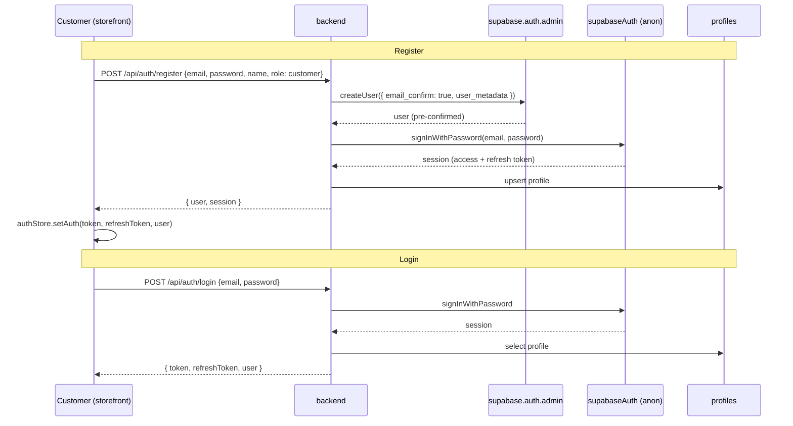
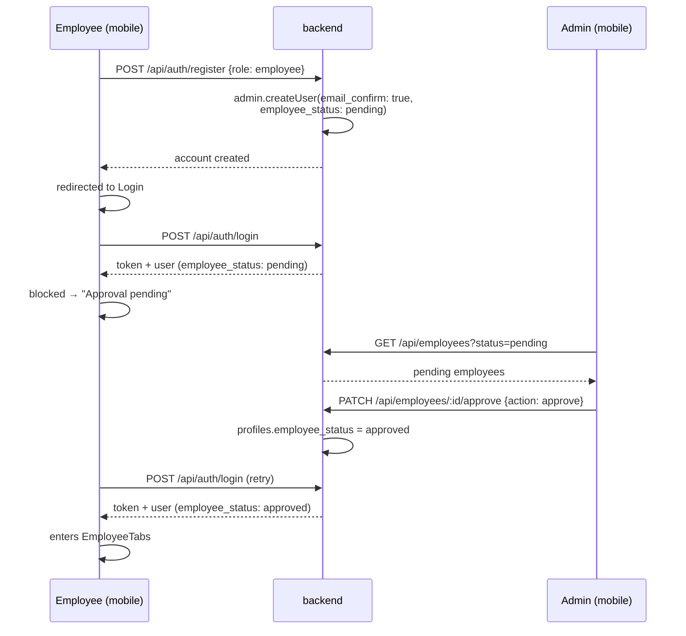
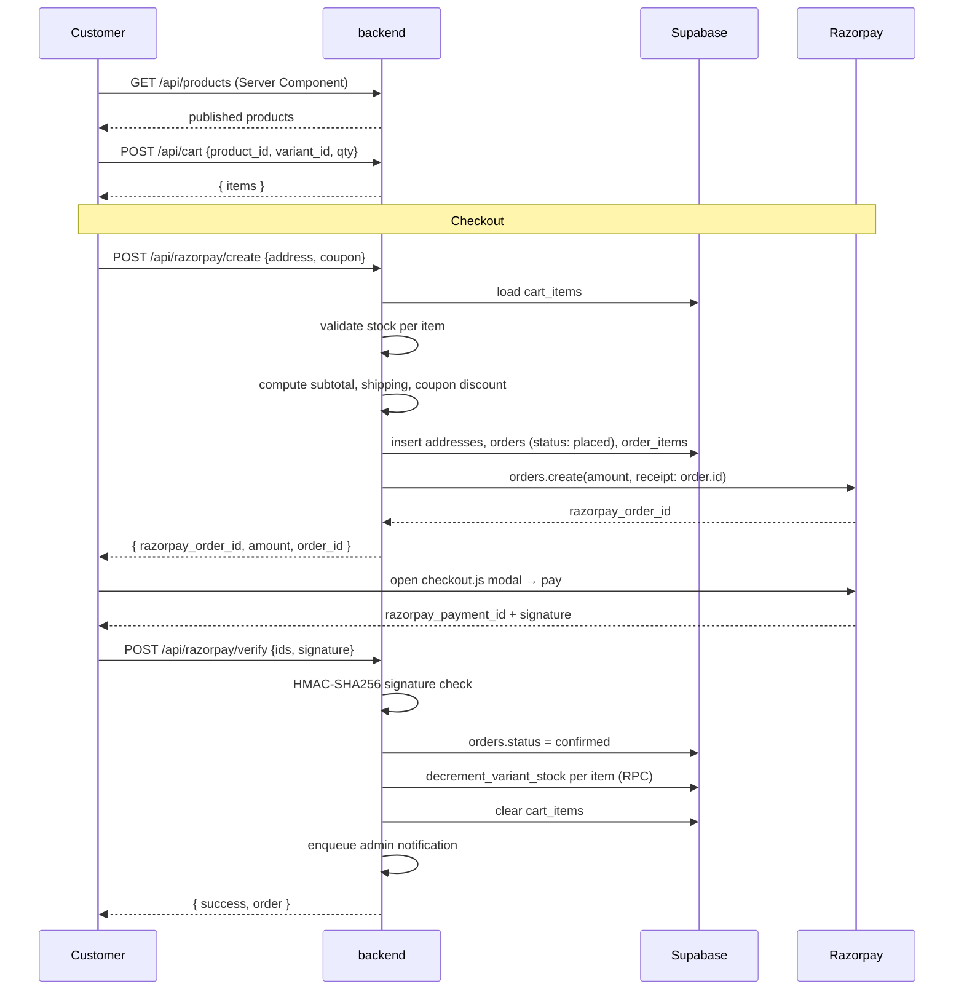
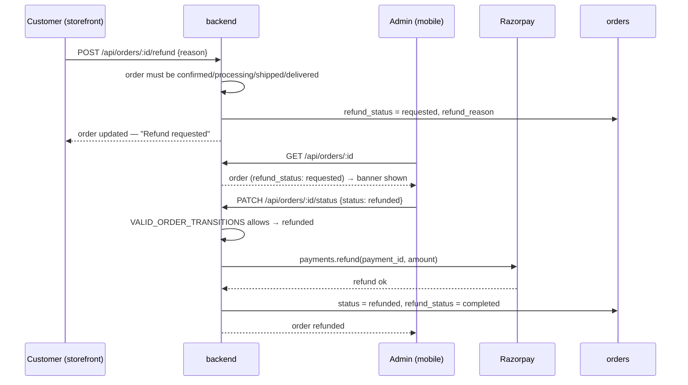
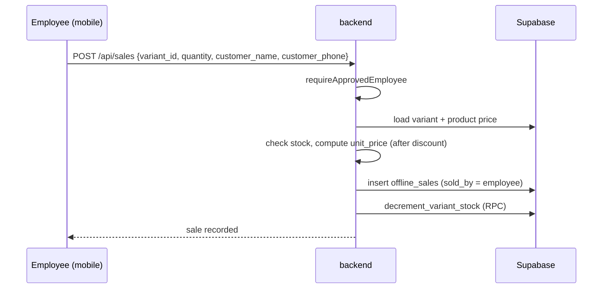
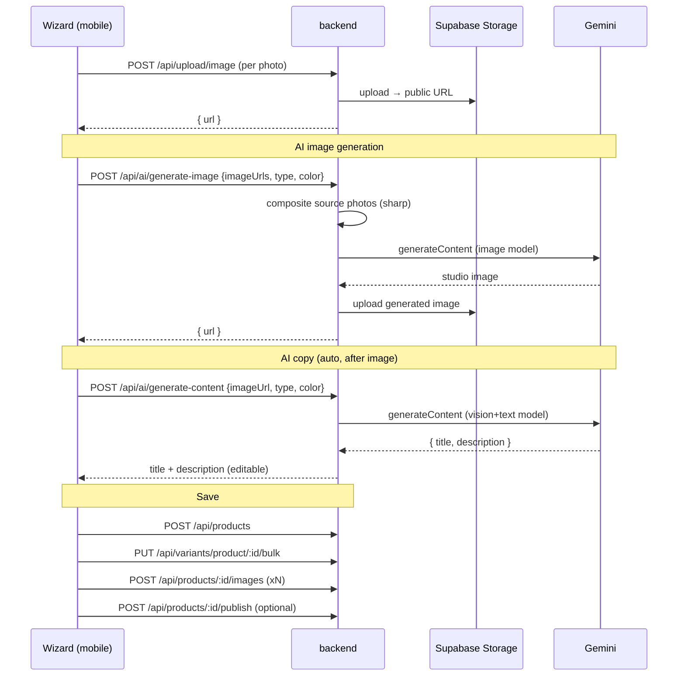
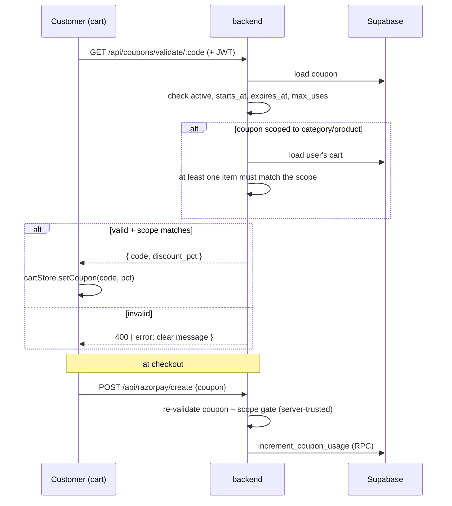
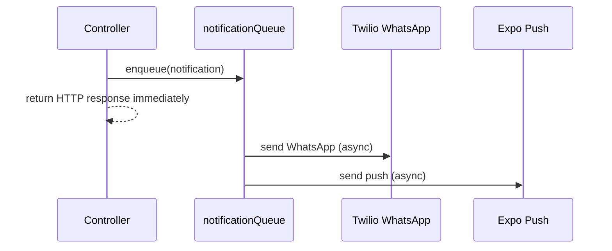
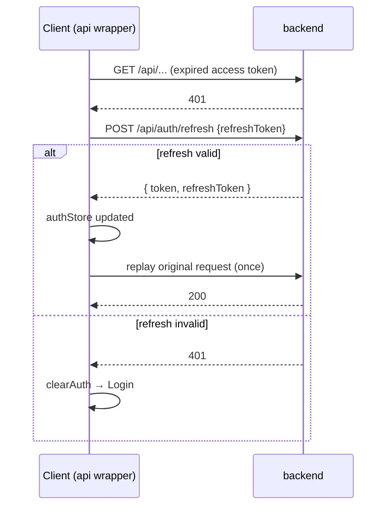

# Runtime Flows

Sequence diagrams for every major flow in NanaBanana.

---

## 1. Customer registration & login

Customers register and sign in on the **storefront**. Accounts are created
pre-confirmed via the admin API — no verification email, no rate-limit issues.

The storefront blocks staff: if a logged-in user's role is not `customer`, the
login screen rejects them.

---

## 2. Employee onboarding & approval

Employees register on the **mobile** app and must be approved by an admin.

`requireApprovedEmployee` middleware admits admins and approved employees only.

---

## 3. Browse → Cart → Checkout → Payment

The core purchase flow. Order totals are **always computed server-side**.

Stock is checked at order creation **and** atomically decremented on payment
verification, so concurrent buyers cannot oversell.

---

## 4. Refund

Customer requests a refund; an admin completes it, issuing a real Razorpay
refund.

If the Razorpay refund call fails, the status change is rejected (`502`) — the
order is never marked refunded without the money actually being returned.

---

## 5. Offline sale ("Mark as sold")

An employee records an in-store sale. Decrements the same stock as online
orders.

`GET /api/sales` scopes results: employees see only their own sales; admins see
all (optionally filtered by `soldBy`).

---

## 6. Product creation + AI (mobile wizard)

The product wizard uploads photos, generates a clean studio image and product
copy with Gemini, then persists the product.

Both AI features use the **Gemini** API (`GOOGLE_GEMINI_API_KEY`) — image
generation and copywriting. No Anthropic key is required.

---

## 7. Coupon validation & scoping

Coupons can be global, or scoped to a category / subcategory / a single
product, with an optional validity window and usage cap.

The cart's display is optimistic; `createRazorpayOrder` re-validates the coupon
and the scope gate at payment time so the final discount is always correct.

---

## 8. Async notifications

WhatsApp and push notifications never block the HTTP response.

Triggers include: a new order placed (notify admin), and an order status
change (notify the customer).

---

## 9. Token refresh

Keeps users signed in past the ~1h access-token expiry.

Concurrent 401s share a single in-flight refresh promise so the refresh
endpoint is called only once.
